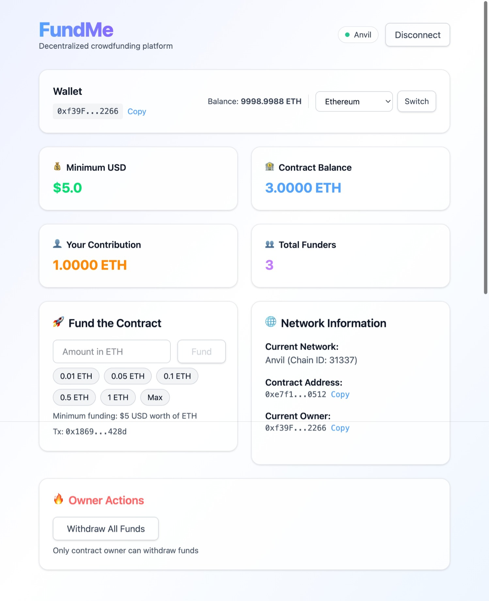

# Foundry Fund Me

Foundry Fund Me is a decentralized crowdfunding smart contract that lets anyone contribute ETH to projects, with each contribution checked to ensure it meets a $5 USD minimum using real-time Chainlink price feeds. Only the contract owner can withdraw funds, and all price conversions are handled by Chainlink oracles. The project features full test coverage with Foundry, supports easy deployment across local, testnet, and mainnet networks, and includes a modern React frontend for seamless interaction.



## 🏁 Quick Start
Follow these steps to get the project running locally:

### 1. Prerequisites
- [Foundry](https://book.getfoundry.sh/getting-started/installation) (latest version)
- [Node.js](https://nodejs.org/) (v16 or higher)
- [Git](https://git-scm.com/)

### 2. Clone and Install
```bash
git clone https://github.com/imranpollob/foundry-fund-me.git
cd foundry-fund-me

# Install Foundry dependencies
forge install

# Install frontend dependencies
npm run install:frontend

# Build the smart contracts
forge build
```

### 3. Start Local Blockchain
```bash
# Start Anvil (local Ethereum node)
anvil
```
This will start a local blockchain at `http://127.0.0.1:8545` with 10 pre-funded accounts.

### 4. Deploy Smart Contract
In a new terminal (keep Anvil running):
```bash
# Deploy to local network
npm run deploy:local
```
This deploys the FundMe contract to your local blockchain and saves the deployment info.

### 5. Generate Frontend ABI
After building the contracts, extract the ABI for the frontend:
```bash
# Extract ABI from compiled contract
npm run extract:abi
```

### 6. Configure Frontend Environment
Create a `.env` file in the `frontend/` directory with your contract addresses:
```bash
# For local development
VITE_CONTRACT_ADDRESS_31337=0xYourDeployedLocalAddress

# For Sepolia testnet (optional)
VITE_CONTRACT_ADDRESS_11155111=0xYourSepoliaAddress

# For Polygon Amoy (optional)
VITE_CONTRACT_ADDRESS_80002=0xYourAmoyAddress
```

### 7. Run Frontend
```bash
# Start the development server
npm run dev:frontend
```

Open [http://localhost:5173](http://localhost:5173) in your browser to interact with the dApp.

### Alternative: Using Testnet
For testnet deployment instead of local:

1. Set up environment variables (`.env` file):
   ```
   SEPOLIA_RPC_URL=your_sepolia_rpc_url
   PRIVATE_KEY=your_private_key
   ETHERSCAN_API_KEY=your_etherscan_api_key
   ```

2. Deploy to Sepolia:
   ```bash
   npm run deploy:sepolia
   ```

3. Update the `frontend/.env` file with the deployed contract address:
   ```
   VITE_CONTRACT_ADDRESS_11155111=0xYourDeployedSepoliaAddress
   ```


For mainnet deployment, update network configurations in `script/HelperConfig.sol` and use:
```bash
forge script script/DeployFundMe.s.sol --rpc-url $MAINNET_RPC_URL --private-key $PRIVATE_KEY --broadcast --verify
```


## 📁 Project Structure

```
foundry-fund-me/
├── foundry.toml                 # Foundry configuration
├── Makefile                     # Build and test automation
├── script/                      # Deployment & interaction scripts
├── src/                         # Smart contract source code
├── test/                        # Test files
├── frontend/                    # React frontend application
│   ├── src/
│   │   ├── contracts.ts         # Contract addresses and ABI import
│   │   ├── FundMeAbi.json       # Contract ABI (generated)
│   │   ├── wagmi.ts             # Web3 configuration
│   │   ├── App.tsx              # Main React component
│   │   └── ...
│   ├── package.json
│   └── .env                     # Environment variables (create this)
└── README.md
│   ├── DeployFundMe.s.sol       # Main deployment script
│   ├── HelperConfig.sol         # Network configuration helper
│   └── Interactions.s.sol       # Contract interaction utilities
├── src/                         # Smart contracts
│   ├── FundMe.sol               # Main crowdfunding contract
│   ├── PriceConversion.sol      # Price conversion library
│   └── FunWithStorage.sol       # Storage demonstration contract
├── test/                        # Test suites
│   ├── mock/                    # Mock contracts for testing
│   │   └── MockV3Aggregator.sol # Chainlink price feed mock
│   └── unit/                    # Unit tests
│       └── FundMeTest.t.sol     # FundMe contract tests
└── lib/                         # External dependencies
    ├── chainlink-brownie-contracts/
    ├── forge-std/
    └── foundry-devops/
```

## 🧪 Testing

Run the complete test suite:
```bash
forge test
```

Run tests with verbose output:
```bash
forge test -vvv
```

Run specific test contract:
```bash
forge test --match-contract FundMeTest
```

Run specific test function:
```bash
forge test --match-test testMinimumUsdIsFive
```


### Code Formatting
```bash
forge fmt
```

### Gas Snapshots
```bash
forge snapshot
```

### VS Code Setup
For Solidity formatting with Forge:
- Open User Settings (JSON)
- Add: `"solidity.formatter": "forge"`

Recommended extensions:
- Solidity - Nomic Foundation
- Foundry - Nomic Foundation
